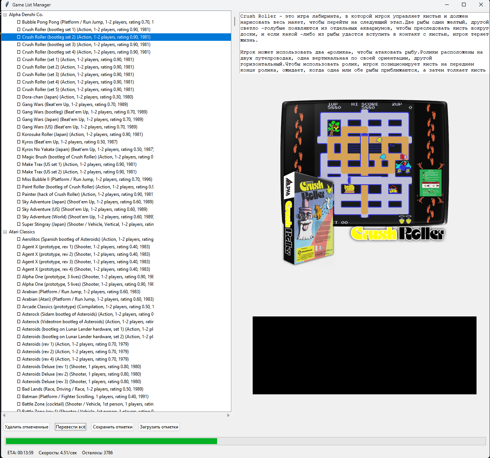

# Game Collection Manager

[English version](README.en.md)



GUI-инструмент для быстрой ручной чистки и отбора больших EmulationStation-style ROM-коллекций.

## 🎮 Зачем я сделал этот инструмент

Когда я собирал коллекцию для RetroArch, особенно под MAME и FBNeo, быстро выяснилось, что основная проблема не в ROM-файлах, а в масштабе самой коллекции.

В аркадных сетах легко набираются десятки тысяч игр. Держать всё подряд бессмысленно: большую часть ты никогда не запустишь, а место на диске, SSD или портативной консоли всегда ограничено. Особенно неприятно то, что сами ROM-файлы часто занимают считанные килобайты, а вот скрейпнутые медиа могут весить уже гигабайты: видео-сниппеты, арты, боксы, скриншоты.

Готовые "курированные" подборки мне не подошли. В них часто не хватает важных игр, а доверять чужому вкусу при сборке своей коллекции не хочется. Поэтому появился этот инструмент: быстрый локальный куратор, который помогает самому решить, что оставить, а что убрать.

## ✨ Что умеет программа

- Показывает рабочий curated XML в виде дерева с настраиваемой группировкой до 3 уровней
- Подтягивает дополнительные MAME/CatVer-данные: категории, жанры, версии MAME, mature-флаг
- Отдельно группирует разные версии одной игры по `cloneof`
- Сразу отображает описание, изображение и gameplay-видео выбранной игры
- Позволяет быстро помечать игры на удаление клавишами прямо в списке
- Сохраняет прогресс между запусками
- Массово переводит описания с английского на русский
- Экспортирует отобранную коллекцию в отдельную папку
- Сжимает `.mp4` превью уже в экспортированной коллекции
- Запоминает размер и позицию окна

## 🚀 Быстрый старт

### 1. Что нужно подготовить

- Windows
- Python 3.12
- Желательно установленный VLC Player для воспроизведения видео внутри приложения

FFmpeg вручную ставить не обязательно: `setup.bat` сам скачает Windows essentials build при первой настройке.

При первом запуске приложение создаёт рядом с коллекцией рабочий файл:

- `checked\curated_gamelist.xml`

Исходный `gamelist.xml` при этом не переписывается.

### 2. Установка

В корне проекта есть всего два пользовательских файла:

- `setup.bat`
- `start.bat`

Для первой настройки:

1. Запусти `setup.bat`
2. Дождись завершения установки зависимостей
3. При необходимости скрипт сам скачает локальный FFmpeg в `game_list_manager\ffmpeg\bin`

### 3. Запуск

1. Запусти `start.bat`
2. Выбери папку коллекции, внутри которой лежит `gamelist.xml`
3. После этого откроется основной интерфейс программы

## 🧭 Как пользоваться

Обычный рабочий сценарий такой:

1. Запусти приложение и выбери папку с коллекцией
2. Программа создаст или подхватит `checked\curated_gamelist.xml`
3. При необходимости выбери группировку дерева: система, жанр, год, mature-флаг, CatVer-категория и другие поля
4. Выбирай игры по одной и смотри описание, обложку и видео справа
5. Если игру хочешь убрать из будущей сборки, пометь её клавишей `*`
6. Если игру хочешь оставить, нажми `/` и переходи дальше
7. Если перед тобой группа версий одной игры, `/` откроет окно выбора конкретной версии, которую нужно оставить
8. Нажми `Исключить отмеченные`, чтобы удалить эти игры только из `curated_gamelist.xml`
9. Выбери каталог экспорта
10. Нажми `Экспорт коллекции`, чтобы собрать новую физическую коллекцию по рабочему XML
11. При необходимости нажми `Сжать видео в экспорте`

### Как устроен интерфейс

- Левая панель: дерево по выбранным полям группировки и отдельные группы версий игры
- Правая панель: описание, изображение и видео выбранной игры
- Нижняя панель: кнопки управления коллекцией
- Блок `Группировка`: до 3 уровней дерева, например `Система -> Жанр`, `Mature -> Система -> CatVer`, `Год -> Система`

Есть два разных типа групп:

- группы по выбранным полям группировки: система, жанр, год, mature-флаг и т.д.
- группы версий одной игры: создаются по `cloneof` / `base_key`

Preview справа показывается для конкретной игры и для группы версий. Для обычных группировок preview не показывается, потому что это не конкретная игра.

### Горячие клавиши

- `*` — отметить выбранную игру или всю выбранную группу к исключению и перейти дальше
- `/` — оставить выбранную игру или группу и перейти дальше
- `/` на группе версий одной игры — открыть окно выбора версии, которую нужно оставить; остальные версии будут отмечены к исключению

Практический сценарий простой:

- игра не нужна: нажми `*`
- игра нужна: нажми `/`
- нужна только одна версия из нескольких: встань на группу версий, нажми `/`, выбери версию

### Что делают кнопки

- `Исключить отмеченные` — удалить отмеченные игры только из `checked\curated_gamelist.xml`
- `Перевести всё` — массово перевести описания в `checked\curated_gamelist.xml` на русский язык
- `Сохранить отметки` — сохранить текущий список отмеченных игр в `<папка_коллекции>\checked\checked.txt`
- `Загрузить отметки` — восстановить ранее сохранённые отметки из `<папка_коллекции>\checked\checked.txt`
- `Выбрать каталог экспорта` — сохранить папку, куда будет собираться новая коллекция
- `Экспорт коллекции` — скопировать ROM-ы, изображения, видео и другие файлы, на которые ссылается `curated_gamelist.xml`, в новую папку
- `Сжать видео в экспорте` — открыть окно пакетного сжатия `.mp4` уже в экспортированной коллекции
- `Перестроить индекс` — пересобрать SQLite-кэш дерева из `checked\curated_gamelist.xml` и CatVer-данных

## ⚠️ Важно: как теперь работает отбор

Текущая версия работает по безопасной схеме:

- исходный `gamelist.xml` остаётся нетронутым
- рабочие изменения пишутся в `checked\curated_gamelist.xml`
- физические файлы исходной коллекции не удаляются при отборе

Физическое копирование ROM-ов, изображений, видео и других медиа происходит только через кнопку `Экспорт коллекции` в выбранную папку назначения.

## 🌐 Перевод описаний

Кнопка `Перевести всё`:

- проходит по всем играм с англоязычным описанием
- переводит `desc` на русский
- сохраняет результат обратно в `checked\curated_gamelist.xml`

Перед переводом автоматически создаётся backup XML:

- `gamelist.bak`
- `gamelist.bak1`
- `gamelist.bak2`
- и так далее

Если описание уже содержит кириллицу, оно не переводится повторно.

## 📦 Экспорт коллекции

Экспорт работает по `checked\curated_gamelist.xml` и собирает новую папку коллекции:

- копирует ROM-файлы
- копирует изображения, видео и другие файловые ссылки из XML
- создаёт в папке назначения новый `gamelist.xml`

Путь экспорта отображается прямо в интерфейсе и сохраняется в:

- `checked\project_state.json`

## 🎥 Сжатие видео

Функция `Сжать видео в экспорте` предназначена для уменьшения размера preview-видео в уже экспортированной коллекции.

Что делает сжатие:

- уменьшает разрешение по заданному коэффициенту
- перекодирует видео в H.264
- кодирует звук в AAC
- при необходимости обрезает ролики до указанной максимальной длительности
- может обрабатывать несколько файлов параллельно

Перед заменой каждого видео создаётся резервная копия в подпапке `backup`.

FFmpeg ищется в таком порядке:

1. `game_list_manager\ffmpeg\bin\ffmpeg.exe` и `ffprobe.exe`
2. системный `PATH`

## 🧱 Структура проекта

```text
setup.bat
start.bat
game_list_manager/
```

- `setup.bat` — первый запуск и подготовка окружения
- `start.bat` — запуск приложения
- `game_list_manager/main.py` — текущая Python entry point
- `game_list_manager/requirements.txt` — список Python-зависимостей
- `game_list_manager/setup.ps1` — служебный setup-скрипт
- `game_list_manager/run.ps1` — служебный run-скрипт
- `checked/curated_gamelist.xml` — рабочий XML с результатом отбора
- `checked/project_state.json` — сохранённый каталог экспорта, группировка дерева и состояние проекта
- `checked/curated_cache.sqlite` — локальный SQLite-кэш для быстрого построения дерева
- `game_list_manager/pS_CatVer_287/` — дополнительные MAME/CatVer-справочники для жанров, категорий и mature-флага

## 📁 Какой формат коллекции ожидается

Программа рассчитана на EmulationStation-style структуру с `gamelist.xml`, например:

```xml
<gameList>
  <game id="123456789">
    <path>roms/game.zip</path>
    <name>Game Title</name>
    <desc>Game description</desc>
    <image>media/images/game.png</image>
    <video>media/videos/game.mp4</video>
    <rating>0.8</rating>
    <releasedate>19920101T000000</releasedate>
  </game>
</gameList>
```

Пути внутри XML должны указывать на реальные файлы внутри выбранной папки коллекции.

## 🎬 Demo

Здесь позже будет добавлено видео с примером использования программы.

## 📝 Примечания

- Текущая поддерживаемая версия проекта живёт в `game_list_manager/`
- Приложение выросло из старой однофайловой версии и уже сильно отличается от неё по структуре
- Локальные runtime-файлы вроде `.venv-py312`, `window_state.json`, скачанного FFmpeg и сохранённых отметок не коммитятся в git
